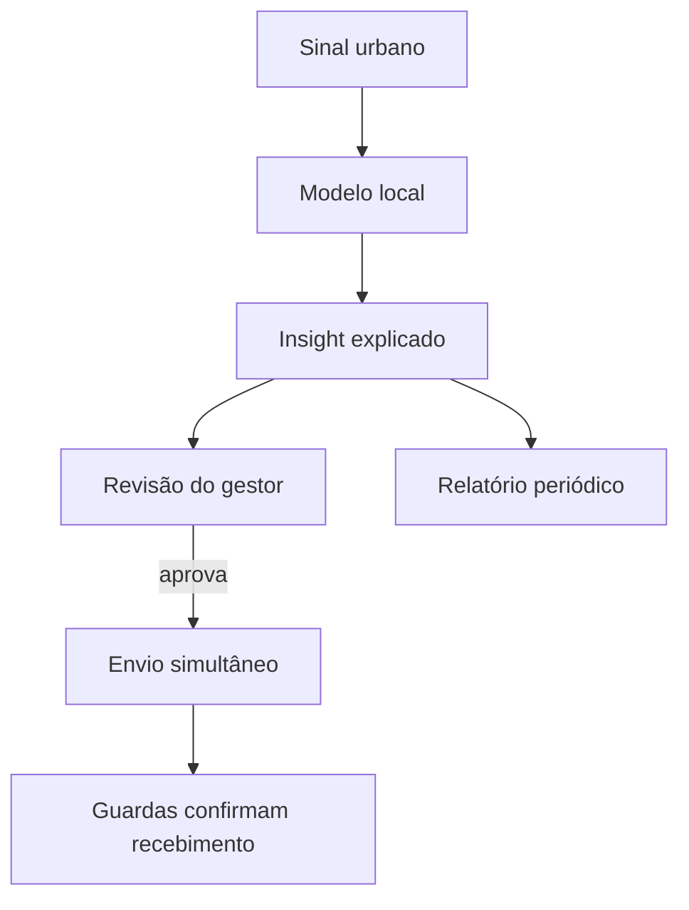

# CAIS — Central de Alerta e Inteligência para Segurança

MVP de inteligência operacional para a Guarda Civil Municipal do Recife. O CAIS recebe sinais urbanos, estima demanda operacional com um modelo local em scikit-learn, transforma o resultado em uma explicação clara, exige aprovação humana e distribui o alerta aos guardas selecionados.

> O CAIS não prevê crimes e não decide pelo gestor. O modelo estima demanda contextual; o Gemini explica evidências; a aprovação e a ação são humanas.

## Fluxo da demonstração



O envio não depende do aceite de um guarda. Todos os destinatários recebem o alerta assim que o gestor aprova; cada um apenas confirma que recebeu.

## O que está implementado

- FastAPI com autenticação por papel (`manager` e `guard`).
- Persistência SQLite e diário append-only de eventos.
- Barramento assíncrono em processo com `asyncio.Queue`.
- Pipeline scikit-learn robusto a categorias desconhecidas.
- Enriquecimento pelo SDK do Gemini, com fallback local para demo offline.
- Busca híbrida local: BM25 + LSA/TF-IDF.
- Painel do gestor com filtros, eventos em tempo real, indicadores, aprovação, rejeição e agente conversacional.
- Relatórios periódicos ou sob demanda, com achados rastreáveis e três alternativas de solução.
- Minuta técnica preparatória para ETP/TR, exportável em Markdown e bloqueada para publicação automática.
- Portal mobile do guarda com confirmação de recebimento e conclusão.
- SSE com polling de segurança no frontend.
- Métricas Prometheus e relatório completo do modelo.
- Docker Compose com API e ngrok configurados separadamente.
- Frontend estático pronto para Vercel.

A especificação completa para outro desenvolvedor/agente está em [docs/ESPECIFICACAO_MVP_CAIS.md](docs/ESPECIFICACAO_MVP_CAIS.md).

## Métricas atuais do modelo

Validação estratificada com 20% da base e limiar 0,50:

| Métrica | Resultado |
|---|---:|
| Acurácia | 90,9% |
| Precisão da classe positiva | 69,9% |
| Recall da classe positiva | 71,2% |
| F1 da classe positiva | 70,6% |
| ROC-AUC | 83,6% |
| PR-AUC | 71,8% |

Esses números são de um protótipo treinado com base híbrida, contendo variáveis sintéticas. Não representam desempenho comprovado numa operação real. O arquivo `modelo_metricas.json` registra dados, parâmetros e matriz de confusão.

## Estrutura

```text
backend/app/
  api/                 rotas e autorização
  services/            predição, Gemini, busca e workflows
  database.py          persistência SQLite
  event_bus.py         barramento e SSE
frontend/
  index.html           login
  gestor.html          painel administrativo
  guarda.html          experiência em campo
docs/
  ESPECIFICACAO_MVP_CAIS.md
  BASE_NORMATIVA_E_ROADMAP_EDITAL.md
Dockerfile
docker-compose.yml
ngrok.yml
treinamento.py
```

## Execução local sem Docker

Requer Python 3.12+.

```bash
python -m venv .venv
source .venv/bin/activate
pip install -r requirements-dev.txt
uvicorn main:app --reload --port 8000
```

Em outro terminal, sirva o frontend:

```bash
python -m http.server 5500 --directory frontend
```

Abra [http://localhost:5500](http://localhost:5500). A documentação da API fica em [http://localhost:8000/docs](http://localhost:8000/docs).

## Credenciais da demonstração

| Perfil | E-mail | Senha |
|---|---|---|
| Gestora | `gestora@cais.recife.br` | `cais2026` |
| Guarda GCM-12 | `guarda12@cais.recife.br` | `cais2026` |
| Guarda GCM-07 | `guarda07@cais.recife.br` | `cais2026` |
| Guarda GCM-21 | `guarda21@cais.recife.br` | `cais2026` |

São contas exclusivamente demonstrativas. Troque o mecanismo de identidade antes de qualquer uso real.

## Docker + HTTPS com ngrok

O Compose usa dois contêineres: a imagem da API e o sidecar oficial do ngrok. Isso evita rodar dois processos dentro da mesma imagem e entrega o ambiente completo com um comando.

```bash
cp .env.example .env
```

Preencha pelo menos `NGROK_AUTHTOKEN` no `.env`. Para usar o modelo conversacional real, preencha também `GEMINI_API_KEY`.

```bash
docker compose up --build
```

Serviços:

- API local: `http://localhost:8000`
- Swagger: `http://localhost:8000/docs`
- Inspetor ngrok: `http://localhost:4040`

A URL HTTPS pública pode ser vista no inspetor ou consultada em `http://localhost:4040/api/tunnels`.

### Variáveis principais

| Variável | Uso |
|---|---|
| `CAIS_CORS_ORIGINS` | URLs do frontend autorizadas, separadas por vírgula |
| `CAIS_INGEST_API_KEY` | chave para fontes automatizadas |
| `CAIS_SEED_DEMO_DATA` | cria dois sinais na primeira inicialização |
| `CAIS_REPORT_SCHEDULE_ENABLED` | ativa a tarefa recorrente de relatórios |
| `CAIS_REPORT_INTERVAL_SECONDS` | intervalo da agenda; padrão de 24 horas |
| `CAIS_REPORT_LOOKBACK_DAYS` | janela de dados consolidada; padrão de 7 dias |
| `GEMINI_MODE` | `auto`, `disabled` ou `required` |
| `GEMINI_API_KEY` | chave usada apenas no backend |
| `GEMINI_MODEL` | modelo configurável sem alteração de código |
| `NGROK_AUTHTOKEN` | autenticação do túnel |

## Frontend no Vercel

1. Importe o repositório no Vercel.
2. Configure **Root Directory** como `frontend`.
3. Framework preset: **Other**; não é necessário comando de build.
4. Faça o deploy.
5. Abra o frontend com `?api=https://SUA-URL.ngrok.app` na primeira vez. O endereço fica salvo no navegador.
6. Acrescente a URL final do Vercel em `CAIS_CORS_ORIGINS` no backend e reinicie o Compose.

Exemplo:

```text
https://seu-cais.vercel.app/?api=https://abc123.ngrok.app
```

Não coloque chave Gemini, token ngrok ou chave de ingestão no frontend.

## API principal

| Método | Rota | Papel |
|---|---|---|
| `POST` | `/api/v1/auth/login` | público |
| `POST` | `/api/v1/signals` | gestor ou `X-API-Key` |
| `GET` | `/api/v1/events` | gestor |
| `POST` | `/api/v1/events/{id}/approve` | gestor |
| `POST` | `/api/v1/events/{id}/reject` | gestor |
| `GET` | `/api/v1/reports` | gestor |
| `POST` | `/api/v1/reports/generate` | gestor |
| `GET` | `/api/v1/reports/{id}` | gestor |
| `GET` | `/api/v1/reports/{id}/draft.md` | gestor |
| `POST` | `/api/v1/assistant/chat` | gestor |
| `GET` | `/api/v1/guards/me/dispatches` | guarda |
| `POST` | `/api/v1/dispatches/{id}/respond` | guarda destinatário |
| `GET` | `/api/v1/health` | público |
| `GET` | `/api/v1/metrics` | público no MVP |

Os filtros de eventos incluem `status`, `criticality`, `local`, `source`, `category`, `q`, `from`, `to`, `limit` e `offset`.

## Busca híbrida e agente

A recuperação combina:

- **BM25 (45%)** para correspondência lexical;
- **LSA sobre TF-IDF (55%)** para proximidade semântica local.

O agente recebe os trechos mais relevantes e suas fontes. Se o Gemini estiver indisponível, a API responde com um fallback extrativo e identifica `provider=local_fallback`. Em produção, embeddings e banco vetorial podem substituir a camada LSA sem alterar o contrato HTTP.

## Relatórios e minuta técnica

Uma tarefa assíncrona gera, por padrão, um consolidado diário dos últimos sete dias. O gestor também pode solicitar um relatório imediatamente no painel. Cada relatório contém estatísticas, evidências, achados e pelo menos três alternativas: ajuste com recursos existentes, coordenação intersecretarial e eventual piloto estruturado.

A minuta exportada é um **insumo preliminar para ETP e termo de referência**, não um edital. Ela não escolhe modalidade, fornecedor ou preço e exige revisão da unidade requisitante, compras/licitações, orçamento, proteção de dados, controle interno, jurídico e autoridade competente. A estrutura segue a fase preparatória e os elementos documentais da [Lei 14.133/2021](https://www.planalto.gov.br/ccivil_03/_ato2019-2022/2021/lei/l14133.htm); os modelos e regulamentos municipais vigentes devem ser confirmados antes de qualquer instrução ou publicação no [PNCP](https://www.gov.br/pncp/pt-br).

A pesquisa, os gates de conformidade e o caminho até um edital real estão documentados em [docs/BASE_NORMATIVA_E_ROADMAP_EDITAL.md](docs/BASE_NORMATIVA_E_ROADMAP_EDITAL.md).

## Treinar novamente

```bash
python treinamento.py
```

O comando atualiza:

- `motor_preditivo_seops.pkl`
- `features_modelo.pkl`
- `modelo_metricas.json`

O pipeline usa `OneHotEncoder(handle_unknown="ignore")`, evitando que locais novos quebrem a inferência.

## Testes

```bash
pytest -q
```

Os testes cobrem autenticação, validação, inferência com categoria desconhecida, processamento assíncrono, aprovação, envio simultâneo, confirmação não bloqueante, busca híbrida, geração de relatório, múltiplas alternativas e exportação da minuta.

## Limites do MVP

- SQLite e barramento em processo pressupõem uma instância da API.
- O ngrok fornece o HTTPS da demonstração; produção deve usar domínio e proxy próprios.
- Não há integração real com COP, CAD, WhatsApp ou bases pessoais.
- Os dados da demo são públicos/agregados ou sintéticos.
- A minuta não substitui ETP, termo de referência, pesquisa de preços, parecer jurídico ou decisão da autoridade competente.
- Antes de produção: PostgreSQL, fila externa, provedor de identidade, monitoramento de drift, testes temporais, auditoria de vieses e revisão LGPD.
