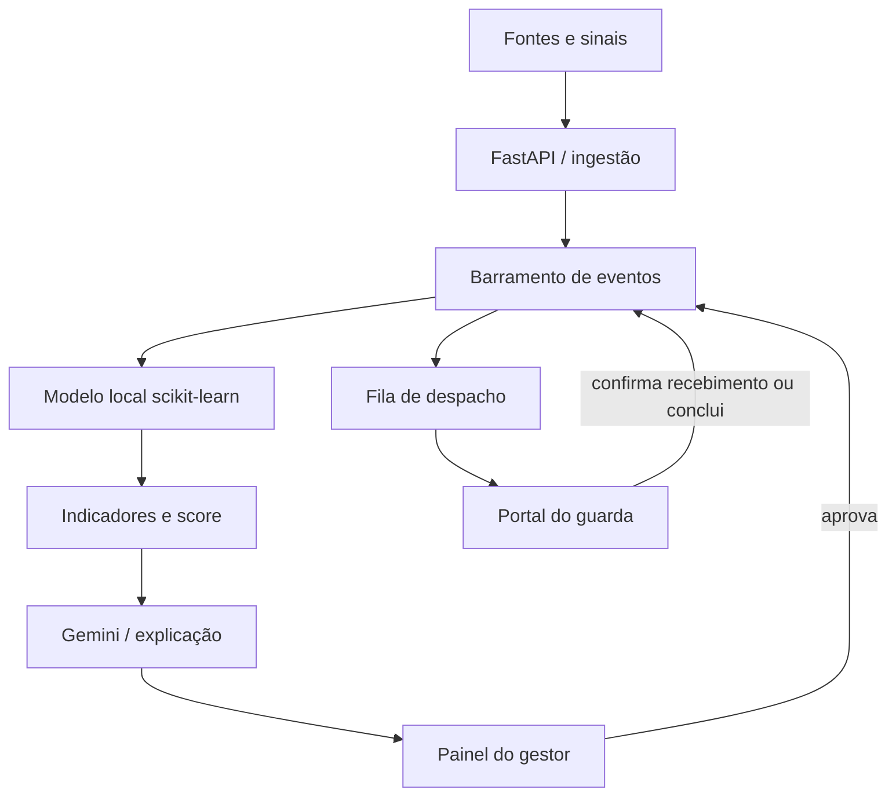

# Especificação de implementação — MVP CAIS

**Produto:** CAIS — Central de Alerta e Inteligência para Segurança
**Público principal:** gestores operacionais da Guarda Civil Municipal do Recife
**Público secundário:** guardas municipais em campo
**Objetivo do MVP:** demonstrar, ponta a ponta, como um sinal urbano vira uma recomendação operacional explicável, passa por aprovação humana, é distribuído simultaneamente aos guardas e alimenta relatórios periódicos para planejamento.

> Esta especificação é o contrato entre produto, backend, frontend, IA e infraestrutura. Caso uma decisão de implementação precise divergir, registrar a mudança no README e preservar os contratos HTTP descritos aqui.

## 1. Resultado obrigatório da demonstração

O fluxo mínimo deve funcionar sem edição manual de banco ou código:

1. Uma fonte envia um sinal bruto para a API.
2. A API responde `202 Accepted` e publica `signal.received` no barramento interno.
3. O modelo local em Python/scikit-learn calcula probabilidade, criticidade e indicadores.
4. O Gemini, quando configurado, transforma **apenas os dados calculados** em uma explicação operacional; sem chave, um gerador local mantém a demo funcional.
5. O evento aparece para o gestor com status `pending_approval`.
6. O gestor visualiza evidências, score, recomendação e cadeia de auditoria.
7. Ao aprovar, a API publica `event.approved`.
8. O sistema identifica os guardas/equipes destinatários e envia o alerta imediatamente a todos eles, sem aguardar resposta individual.
9. Cada guarda confirma o recebimento. Essa confirmação é rastreabilidade de entrega e **não** aprovação, aceite da missão ou bloqueio para outros destinatários.
10. O guarda visualiza o alerta numa rota separada, confirma o recebimento e pode registrar a conclusão quando aplicável.
11. O gestor acompanha a mudança de status em tempo real ou por atualização automática.

O Gemini **não** decide criticidade, aprovação, culpabilidade, perfil individual ou despacho. A decisão operacional permanece humana.

## 2. Contexto técnico já presente no repositório

- `dataset_seops.csv`: 5.000 registros de treinamento, combinando base municipal e variáveis sintéticas.
- `motor_preditivo_seops.pkl`: artefato scikit-learn.
- `features_modelo.pkl`: metadados usados pela versão inicial.
- `treinamento.py`: treino e avaliação.
- `script.py`: coleta/geração de dados.
- `main.py`: API inicial com uma rota de predição.

Problemas conhecidos que precisam ser corrigidos:

1. `pd.get_dummies(..., drop_first=True)` em uma única linha de inferência elimina as categorias da própria linha. Preferir um `Pipeline` com `OneHotEncoder(handle_unknown="ignore")`; na compatibilidade com artefato antigo, usar `drop_first=False` e alinhar às features salvas.
2. A acurácia isolada mascara o desbalanceamento. O modelo original pode atingir aproximadamente 85% de acurácia prevendo apenas a classe negativa. Registrar também precision, recall e F1 da classe positiva, ROC-AUC, PR-AUC e matriz de confusão.
3. O dataset contém componentes sintéticos. A interface e o pitch devem exibir essa limitação; métricas não podem ser apresentadas como desempenho em operação real.

## 3. Arquitetura de referência



Implementação adequada ao hackathon:

- FastAPI com `lifespan` para inicialização.
- SQLite para persistência do MVP, com consultas encapsuladas para permitir PostgreSQL no futuro.
- Barramento assíncrono em processo (`asyncio.Queue`) e diário durável de eventos no SQLite.
- Server-Sent Events (SSE) ou polling como fallback para atualização do front.
- Frontend estático em HTML, CSS e JavaScript, sem etapa de build.
- Imagem Docker para a API e ngrok em serviço sidecar no Docker Compose.
- Frontend hospedável separadamente no Vercel.

Limitação deliberada: o barramento em processo atende uma única instância do MVP. Para múltiplas réplicas, substituir por Redis Streams, RabbitMQ ou Kafka sem mudar os nomes dos eventos.

## 4. Estados e eventos de domínio

### Estado de um evento operacional

`processing → pending_approval → approved → distributed → completed`

Saídas alternativas:

- `pending_approval → rejected`
- `approved → unassigned` quando não houver destinatário elegível

### Estado de um despacho

`sent → acknowledged → completed`

Todos os despachos de um evento aprovado são criados e enviados na mesma etapa. Um destinatário não depende da confirmação de outro.

### Nomes mínimos de eventos

| Evento | Produzido quando | Consumidor principal |
|---|---|---|
| `signal.received` | sinal bruto persistido | pipeline preditivo |
| `risk.assessed` | inferência local concluída | enriquecimento conversacional |
| `insight.created` | insight pronto para revisão | painel do gestor |
| `event.approved` | gestor aprova | orquestrador de despacho |
| `event.rejected` | gestor rejeita | auditoria/painel |
| `dispatch.sent` | missão enviada a um guarda | portal do guarda |
| `dispatch.acknowledged` | guarda confirma o recebimento | painel/auditoria |
| `dispatch.completed` | atendimento concluído | indicadores/painel |
| `report.generation.requested` | agenda ou gestor solicita consolidação | gerador de relatórios |
| `report.generated` | relatório e minuta técnica persistidos | painel/agente |
| `report.generation.failed` | geração falha sem derrubar o barramento | observabilidade/painel |

Todo evento deve possuir `event_id`, `aggregate_id`, `event_type`, `occurred_at`, `actor_id` opcional e `payload` JSON. O diário é append-only.

## 5. Contratos HTTP mínimos

Prefixo: `/api/v1`.

### Autenticação da demo

- `POST /auth/login`
- `GET /auth/me`

Entrada:

```json
{
  "email": "gestora@cais.recife.br",
  "password": "cais2026"
}
```

Saída: token opaco, validade e perfil. Endpoints privados usam `Authorization: Bearer <token>`.

### Ingestão

- `POST /signals` → `202 Accepted`

```json
{
  "source": "COP",
  "local": "Praça do Arsenal",
  "category": "aglomeracao",
  "description": "Três chamados relacionados em dez minutos",
  "dia_semana": 5,
  "hora_dia": 21,
  "eventos_proximos": 1,
  "historico_ocorrencias_7d": 12,
  "iluminacao_ativa_pct": 48,
  "iluminacao_fonte": "real",
  "densidade_pessoas": 88,
  "latitude": -8.0611,
  "longitude": -34.8711
}
```

Resposta:

```json
{
  "signal_id": "sig_...",
  "status": "processing",
  "message": "Sinal recebido para processamento assíncrono"
}
```

### Gestão

- `GET /events` com filtros `status`, `criticality`, `local`, `source`, `category`, `q`, `from`, `to`, `limit`, `offset`.
- `GET /events/{event_id}`.
- `GET /events/{event_id}/timeline`.
- `POST /events/{event_id}/approve` com `guard_ids` opcional e observação.
- `POST /events/{event_id}/reject` com motivo obrigatório.
- `GET /dashboard/summary`.
- `GET /guards`.

### Relatórios

- `GET /reports` lista relatórios e o estado da agenda.
- `GET /reports/schedule` retorna cadência, janela e próxima execução.
- `POST /reports/generate` recebe `lookback_days` (1–365) e título opcional; retorna `202`.
- `GET /reports/{report_id}` retorna estatísticas, achados, alternativas, evidências e minuta.
- `GET /reports/{report_id}/draft.md` exporta a minuta técnica em Markdown.

O endpoint de geração apenas publica `report.generation.requested`; a resposta não deve aguardar Gemini, consolidação ou escrita do relatório.

### Guarda

- `GET /guards/me/dispatches`.
- `POST /dispatches/{dispatch_id}/respond` com ação `acknowledge` ou `complete`.

### Agente e busca híbrida

- `POST /assistant/search`.
- `POST /assistant/chat`.

Entrada de chat:

```json
{
  "question": "Quais áreas apresentam maior necessidade de reforço hoje?",
  "filters": {"status": "pending_approval"},
  "top_k": 5,
  "conversation_id": "opcional"
}
```

Saída deve conter `answer`, `sources`, `provider` (`gemini` ou `local_fallback`) e `retrieval` com estratégia e tempo.

### Operação

- `GET /health` com estado do banco, modelo, barramento e Gemini.
- `GET /model/metrics`.
- `GET /stream` para SSE.
- `GET /metrics` no padrão Prometheus, fora ou dentro do prefixo desde que documentado.
- Manter `POST /predicao-risco` como compatibilidade com a API inicial.

## 6. Modelo local e indicadores

O modelo recebe as colunas brutas:

- `local`
- `dia_semana` (0–6)
- `hora_dia` (0–23)
- `eventos_proximos` (0/1)
- `historico_ocorrencias_7d`
- `iluminacao_ativa_pct` (0–100)
- `iluminacao_fonte`
- `densidade_pessoas` (0–100)

Saída mínima:

- `probability` entre 0 e 1;
- `requires_preventive_action`;
- `criticality`: `low`, `medium` ou `high`;
- `drivers`: fatores observáveis que explicam o contexto;
- `recommended_action` determinística;
- `model_version`.

Nunca chamar o resultado de “previsão de crime”. Usar “previsão de demanda operacional”, “risco contextual” ou “necessidade estimada de atuação preventiva”.

## 7. Gemini e regras de geração

Usar o SDK oficial `google-genai`, configurado por:

- `GEMINI_API_KEY`
- `GEMINI_MODEL`
- `GEMINI_MODE=auto|disabled|required`

Regras:

1. Temperatura baixa.
2. Nunca permitir que o texto gerado altere score, criticidade ou recomendação do modelo local.
3. Incluir no prompt apenas o contexto recuperado e os indicadores do evento.
4. Responder “não há evidência suficiente” quando a base não sustentar a conclusão.
5. Não inferir intenção, culpa, etnia, gênero, classe social ou risco individual.
6. Registrar apenas metadados necessários; não logar a chave nem dados pessoais sensíveis.
7. Em falha/timeout, usar resposta local determinística e identificar `provider=local_fallback`.

## 8. Busca híbrida

O MVP deve funcionar sem serviço vetorial externo:

- componente lexical: BM25;
- componente semântico local: TF-IDF + LSA (`TruncatedSVD`) com similaridade do cosseno;
- fusão: normalização dos scores e combinação ponderada;
- fontes: documentos de contexto, eventos operacionais, indicadores, timeline e metadados permitidos;
- filtros aplicados **antes** ou de forma claramente documentada na recuperação;
- cada trecho retornado inclui `document_id`, `title`, `source`, `score` e metadados.

Peso inicial sugerido: 45% lexical e 55% semântico. Tratar como parâmetro, não como verdade científica. Em produção, embeddings e banco vetorial podem substituir o LSA mantendo o mesmo contrato.

## 9. Relatórios agendados e apoio ao planejamento

O scheduler deve ser configurável por `CAIS_REPORT_SCHEDULE_ENABLED`, `CAIS_REPORT_INTERVAL_SECONDS`, `CAIS_REPORT_LOOKBACK_DAYS` e `CAIS_REPORT_RUN_ON_STARTUP`. No MVP ele roda no processo da API; em produção deve migrar para scheduler/fila externos com execução idempotente.

Cada relatório deve conter:

- período, versão/provedor e IDs dos eventos usados como evidência;
- total, score médio, distribuição por criticidade/status, locais e categorias mais recorrentes;
- taxa de confirmação e conclusão dos despachos;
- achados descritivos que não aleguem causalidade;
- no mínimo três alternativas comparáveis, com custo qualitativo, prazo, requisitos, riscos e métricas;
- resumo conversacional via Gemini ou fallback local determinístico;
- minuta técnica preliminar para apoiar ETP/TR.

Alternativas mínimas:

1. ajuste operacional reversível com recursos existentes;
2. atuação intersecretarial sobre fatores contextuais;
3. piloto estrutural/tecnológico, condicionado à comprovação de necessidade e ao processo de contratação.

### Limites da minuta de contratação

A saída é `insumo_preliminar_para_etp_e_termo_de_referencia`, nunca um edital pronto. Deve incluir aviso de não publicação, problema, interesse público, limites, requisitos, comparação de soluções, resultados, mapa de riscos, referências, campos ausentes e gates de aprovação.

A base verificada e o roadmap para um documento publicável estão em `docs/BASE_NORMATIVA_E_ROADMAP_EDITAL.md`.

Base de estrutura: Lei Federal 14.133/2021, especialmente princípios (art. 5º), conceitos de ETP/TR (art. 6º), planejamento da fase preparatória (art. 18), pesquisa de preços (art. 23), publicidade (art. 54) e PNCP (art. 174). Os regulamentos, manuais e modelos vigentes da Prefeitura do Recife precisam ser confirmados pela unidade municipal de contratação antes de instrução ou publicação.

O sistema não pode inventar preço, quantitativo, dotação, modalidade, critério de julgamento, fornecedor, parecer ou autorização. Revisões obrigatórias: unidade requisitante, área técnica/TI, compras, orçamento, proteção de dados, controle interno, jurídico e autoridade competente.

## 10. Interface do gestor

Identidade:

- `#0B2545`: marinho institucional;
- `#14213D`: fundo profundo;
- `#E98A21`: alerta/dado em circulação;
- `#EDEFF2`: superfície clara.

Layout desktop:

- navegação à esquerda;
- conteúdo central com resumo, indicadores, filtros e lista/mapa operacional;
- painel persistente de eventos à direita;
- detalhe em drawer/modal com score, evidências, timeline e botões Aprovar/Rejeitar;
- agente CAIS acessível sem esconder o fluxo operacional.
- seção de relatórios com agenda, histórico, alternativas e download da minuta técnica.

Filtros mínimos: período, status, criticidade, local, fonte e busca textual. Exibir estados de carregamento, vazio, erro, reconexão e confirmação de ação.

O laranja é semântico: alerta, novidade ou ação que exige atenção. Não usar como decoração indiscriminada.

## 11. Interface do guarda

Rota/página separada, mobile-first:

- identificação do guarda e status;
- missão ativa com local, criticidade, resumo, recomendação e horário;
- ações Confirmar recebimento e Concluir; não há aceite que bloqueie ou redistribua a fila;
- histórico recente;
- nenhum acesso a métricas administrativas ou a ocorrências de outros guardas.

## 12. Métricas e observabilidade

Métricas de modelo:

- precision, recall e F1 da classe positiva;
- ROC-AUC e PR-AUC;
- matriz de confusão;
- distribuição das classes;
- tamanho e natureza da base (`real`, `sintética` ou `híbrida`).

Métricas da API:

- contagem por método, rota e status;
- latência por rota (`histogram`);
- inferências por criticidade;
- falhas do modelo/Gemini;
- profundidade da fila de eventos;
- eventos pendentes de aprovação;
- despachos enviados, confirmados e concluídos;
- tempo entre envio e confirmação de recebimento.
- relatórios gerados/falhos por origem (`manual`, `scheduled`, `startup`).

Evitar labels Prometheus de alta cardinalidade como `event_id`, usuário ou local.

## 13. Segurança mínima

- CORS limitado ao domínio do Vercel em produção.
- Credenciais e chaves apenas por variáveis de ambiente.
- Chave de ingestão opcional via `X-API-Key` para fontes automatizadas.
- Senhas da demo armazenadas com salt e hash, nunca em texto puro no banco.
- Autorização por papel: `manager` e `guard`.
- Validação de intervalos nos schemas.
- Limite de tamanho de texto e de `top_k`.
- IDs gerados no servidor.
- Auditoria de aprovações, rejeições e respostas.
- LGPD: usar dados sintéticos na demonstração e evitar qualquer perfil individual sensível.

As credenciais fixas de demonstração devem ser claramente marcadas como não produtivas.

## 14. Deploy

### Backend/VM

Entregáveis:

- `Dockerfile` da API;
- `docker-compose.yml` com `api` e `ngrok`;
- `ngrok.yml` apontando para `api:8000`;
- volume persistente para SQLite;
- healthcheck;
- execução por usuário não-root;
- `.env.example`.

Fluxo esperado:

```bash
cp .env.example .env
# preencher NGROK_AUTHTOKEN e, opcionalmente, GEMINI_API_KEY
docker compose up --build
```

O inspetor local do ngrok fica em `http://localhost:4040`; a URL HTTPS pública deve ser copiada para a configuração do frontend.

### Frontend/Vercel

- pasta `frontend/` sem build obrigatório;
- `vercel.json` com rotas estáticas;
- `frontend/assets/js/config.js` ou parâmetro `?api=` para definir a URL HTTPS do backend;
- nenhuma chave Gemini ou segredo no frontend.

## 15. Testes de aceite

1. Health retorna modelo carregado e banco acessível.
2. Login diferencia gestor e guarda e bloqueia papel incorreto.
3. Ingestão inválida retorna `422`.
4. Ingestão válida retorna `202` e cria insight pendente.
5. Categoria desconhecida não quebra a inferência.
6. Gestor aprova; todos os guardas selecionados/compatíveis recebem `sent` imediatamente.
7. Um guarda confirma recebimento; os demais despachos não são alterados nem bloqueados.
8. Guarda conclui o atendimento; a conclusão aparece na timeline e no painel.
9. Rejeição exige motivo e não cria despacho.
10. Chat retorna resposta com fontes; sem chave Gemini usa fallback.
11. Filtros de eventos combinam corretamente.
12. `/metrics` não expõe chaves nem dados pessoais.
13. Docker sobe e passa no healthcheck.
14. Frontend funciona apontando para localhost e para uma URL ngrok.
15. Solicitação de relatório retorna `202` e gera ao menos três alternativas.
16. Relatório entra na busca híbrida e a minuta exportada contém aviso de não publicação.
17. Scheduler pode ser desativado nos testes e encerrado sem deixar tarefa pendente.

## 16. Divisão sugerida entre desenvolvedores/agentes

Para evitar conflito, trabalhar em branches separadas e não reformatar arquivos fora do pacote assumido.

### Pacote A — backend e IA

- `backend/**`
- `treinamento.py`
- `main.py`
- testes de API/serviços
- workflow, scheduler, agregações e minuta técnica dos relatórios

### Pacote B — frontend e experiência

- `frontend/**`
- consumir estritamente os contratos desta especificação;
- implementar histórico/detalhe de relatórios e download da minuta;
- usar mocks locais apenas enquanto a API não estiver disponível;
- não duplicar regra de criticidade ou despacho no navegador.

### Pacote C — infraestrutura e documentação

- `Dockerfile`
- `docker-compose.yml`
- `ngrok.yml`
- `.env.example`
- README e roteiro de demo

Antes do merge: executar testes, subir o Compose, validar CORS com o front e percorrer o fluxo completo com dois perfis.

## 17. Fora do escopo do hackathon

- integração real com CAD/COP, WhatsApp ou câmeras;
- predição de crime ou risco individual;
- reconhecimento facial;
- alta disponibilidade/múltiplas réplicas;
- fila externa e banco vetorial gerenciado;
- georreferenciamento de precisão operacional;
- envio real de notificações a servidores públicos.
- publicação automática de edital/PNCP, definição autônoma de modalidade ou pesquisa automática de preços.

Esses itens podem aparecer como evolução, nunca como funcionalidade já entregue.

## 18. Definição de pronto

O MVP está pronto quando uma pessoa consegue abrir o sistema do zero, entrar como gestor, gerar/receber um sinal, visualizar a análise, perguntar ao agente sobre as evidências, aprovar o evento, entrar como guarda em outra janela, receber o alerta, confirmar o recebimento e ver o resultado refletido no painel — e então gerar um relatório com três alternativas, evidências e minuta preliminar marcada para revisão, com logs, timeline e métricas coerentes.
